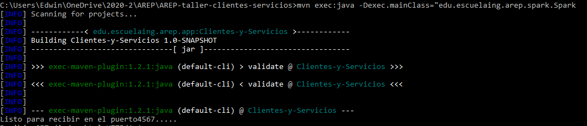
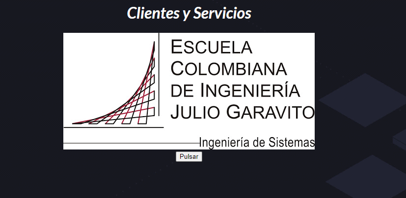
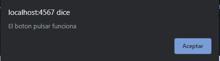

# Clientes y servicios - Taller 3
El objetivo de este taller es crear un servidor web capas de responder a miltiples solicitudes, para esto se hacer el uso de la arquitectura cliente servidor que es el mas usado para aplicaciones y paginas web en el mundo del internet.

## Prerequisitos

Entender como funciona la arquitectura de cliente servidor, y que usos tiene.

- Funcionalidades
  - Proveer un servidor http que responda a varia solicitudes


## Descarga y instalación

Para clonar este repositorio basta con copiar la siguiente linea en un Shell de cualquier sistema operativo

```
git clone https://github.com/Edyesid/AREP-taller-clientes-servicios
```

Es recomendable tener instalado maven en su computadora para poder visualizar de una mejor manera las pruebas y compilación del taller. para esto dirijase al pagina de maven y siga los pasos de instalación.

[Download Maven](https://maven.apache.org/install.html)

Una vez que tenga maven en su computadora, dirijase a la carpeta raiz del taller-1 y para compilar el proyecto se deber introducir el siguiente comando:

**mvn package**

Para poder ejecutar el programa introduce el siguiente comando
```
mvn exec:java -Dexec.mainClass="edu.escuelaing.arep.spark.Spark
```



Con este comando empezara a correr el servicio Http, y podras abrir la pagina desde el browser con la siguiente dirección http://localhost:4567/index.html

## Pruebas  [](https://circleci.com/gh/Edyesid/AREP-taller-clientes-servicios)

Una vez el servicio esta corriendo, se podra encontrar una pagina html con la ruta /index.html donde la cual muestra lo siguiente



para probar el funcionamiento de la funcion de JavaScript se tiene que hacer el uso del boton "pulsar" el cual nos muestra una alerta con el siguiente mensaje:



## Construido

[Eclipse](https://www.eclipse.org/) plataforma de código abierto para el desarrollo de aplicaciones

## Despliegue automatico
para ver la pagina desplegada en heroku puede ir al siguiente link

[heroku](https://arep-clientes-servicios.herokuapp.com/index.html)

## Autor

Edwin Yesid Rodriguez Maldonado

## Licencia

Este proyecto es bajo la licencia GNU GENERAL PUBLIC LICENSE
